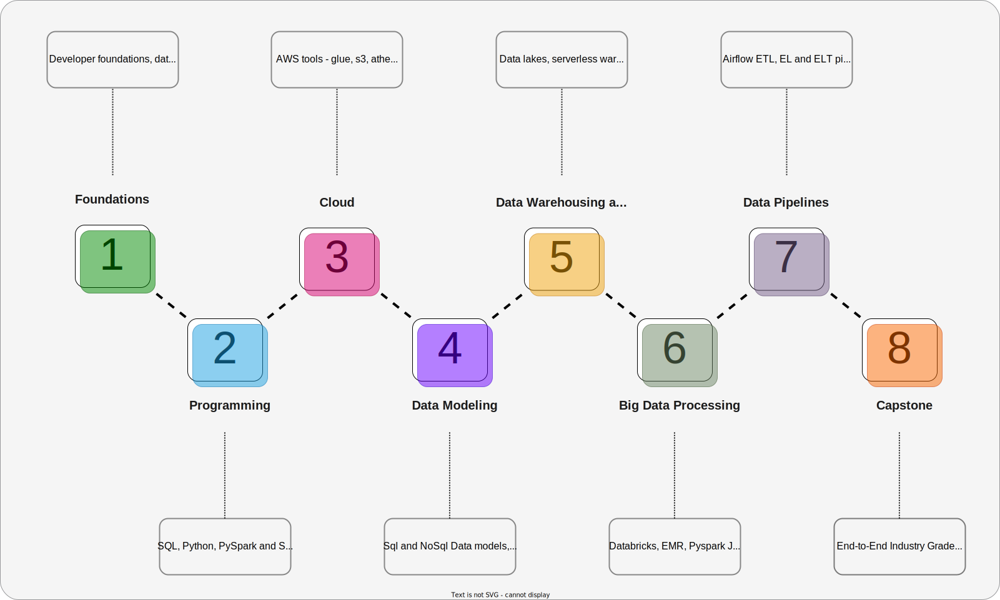

# Curriculum

**Estimated Time**

- Monologue mode: 20 hrs
- Interactive mode: 35 hours

## Module 1 - Developer Foundations

Tools: Visual Studio Code (VSCode), Anaconda Python, Github and Bash Shell

**Labs**

1. [ ] Download and Install vscode
2. [ ] Understand vscode features
3. [ ] Install extensions in vscode
4. [ ] Download and Install Anaconda
5. [ ] Create virtual environment in anaconda
6. [ ] Create jupyter notebook in vscode and connect to venv
7. [ ] Create github account
8. [ ] Install git cli
9. [ ] Create git repo and add students as collaborator
1. [ ] Connect local workspace to git repo
1. [ ] Learn git commands
1. [ ] Learn bash commands
1. [ ] Download and Install DBeaver

## Module 2 - Data Engineering Foundations

In this module, we will learn the basic concepts we should know as a data engineer. We will focus primarily on the following set of questions:

1. What is Data Engineering?
2. Role of Data Engineering in Organizations
3. Skills required to become a Data Engineer
4. What is data lake and data warehouse?
5. What is medallion architecture?
6. What is EL, ETL and ELT?
7. What are the benefits of cloud computing?
8. OLTP vs OLAP technologies

## Module 3 - Cloud Computing

**Tools**: AWS S3, RDS, Redshift, AWS Glue, Athena, AWS Lambda, EMR and EMR Serverless, Keyspace, Cloudformation, AWS IAM, Secrets Manager, Azure and GCP overview

**Concepts:** Cloud Computing and Data Engineering tools in Cloud

**Labs**

1. [ ] (Optional) Create AWS Account
2. [ ] Create IAM user and generate credentials
3. [ ] Install AWS CLI
4. [ ] Setup AWS credentials
5. [ ] Walkthrough of various AWS Services
6. [ ] Copy and Sync data to/from S3
7. [ ] Create database in RDS DBMS and generate credentials
8. [ ] Connect to RDS DBMS in DBeaver
9. [ ] Pull credentials from Secrets Manager in Python using Boto3
1. [ ] Azure Cloud Overview
1. [ ] GCP Cloud Overview

## Module 4 - Python Programming

In this module, we will learn the essential python concepts we use in data engineering. We will primarily focus on the following topics:

1. Lists and dictionaries
2. For loops and while loops
3. Functions and Inline functions
4. Pandas Dataframes
5. `requests` library
6. `psycopg2` and `sqlalchemy` library

**Labs**

* [ ] Building Functions in Python
* [ ] Read/Write and Manipulate Data using Pandas
* [ ] Data Format Conversion - CSV to Parquet, JSON to CSV/Parquet
* [ ] Pulling Data from APIs using requests library
* [ ] Connect to Postgres and Redshift from Python
* [ ] Load and Read the data from Postgres using Python

## Module 5 - SQL Programming

**Labs**

* [ ] SQL Basic - SELECT, LIMIT, WHERE, Comparison and Logical Operators, ORDER BY
* [ ] SQL Intermediate - Aggregation Functions, GROUP BY, CASE, JOINS
* [ ] SQL Advanced - Dates, Texts, Subqueries, Window Functions, EXPLAIN

## Module 6 - PySpark Programming

**Tools and Concepts**

1. Spark and Hadoop Fundamentals
2. Databricks
3. Spark UDFs
4. Spark Dataframe API

**Labs**

1. [ ] Create Databricks Account
2. [ ] Create Spark Cluster in Databricks
3. [ ] M&M Analysis
4. [ ] Movielens and Song Analysis
5. [ ] San Francisco Fire Department Analysis
6. [ ] Data Transformation with PySpark
7. [ ] Connect AWS to PySpark
8. [ ] ETL Pipeline with AWS S3 and PySpark

## Module 7 - Scala Programming

**Labs**

1. [ ] Introduction to Scala Programming
2. [ ] Transform complex data types
3. [ ] Extract and Load Process with Spark Scala, S3 and Postgres

## Module 8 - Data Modeling with RDBMS/NoSQL

**Tools and Concepts**

1. Data Modeling
2. SQL vs NoSQL
3. Star and Snowflake Schema
4. Postgres
5. Cassandra

**Labs**

1. [ ] Music Data Modeling with Postgres
2. [ ] Music Data Modeling with Cassandra
3. [ ] Healthcare Data Modeling with Postgres
4. [ ] Building Data Model in Snowflake

## Module 9 - Data Warehouse and Data Lakes

**Tools**: Redshift, S3, Snowflake, BigQuery, Deltalake, Athena

**Concepts**: Data Warehouses, Data Lakes, Data Lakehouses

**Labs**

1. [ ] Loading Data into Redshift
2. [ ] Queries in Redshift
3. [ ] Loading Data into Snowflake
4. [ ] Queries in Snowflake
5. [ ] GCP BigQuery Overview
6. [ ] Data lake with AWS, S3 and Athena
7. [ ] Working with Delta lake in Databricks

## Module 10 - Big Data Processing

**Tools**: EMR (Serverless), Databricks, dbt, Lambda

**Concepts**: Spark and Hadoop, Spark Jobs, Big Data Processing, Clusters, Horizontal and Vertical Scaling

**Labs**

1. [ ] Processing data with EMR Serverless
2. [ ] Processing data using dbt in Snowflake
3. [ ] Processing data with Databricks
4. [ ] Building Serverless Pipeline in Lambda

## Module 11 - Building Data Pipelines

**Tools and Concepts**

1. Data Pipelines (ETL/ELT)
2. Apache Airflow
   1. UI
   2. Operators
   3. Variables
   4. Plugins
   5. Schedules
   6. etc.

**Labs**

1. [ ] Install Airflow in your PC
2. [ ] First DAG/Pipeline - executing Bash commands
3. [ ] CSV to JSON ETL Pipeline
4. [ ] ACLED Data Pipeline

## Module 12 - End-to-End Industry Grade Project

Project: Building an ELT pipeline with dbt and Redshift

- We will build an end-to-end project with tools and concepts we learned and adopted in the training sessions.
- The project will be added in your resume.
- We will also release the project in your github. (Recruiters are interested in seeing your projects in git
